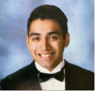

# CPS493_Fall2021
*This repo is for all students to follow*

## Uses Bulma for styling

Hello, my name is Christopher Tejada, I am a senior pursuing a computer science degree at SUNY New Paltz. I would say that most of my computer experience has come from my roughly 3 years of university studies, prior to that, my computer knowledge was limited. I did my first year of college at the University at Buffalo and took some computer science courses in my two semesters at Buffalo. Some of the courses that I took were: CSE 115 (Intro to Computer Science for Majors I), CSE 116 (Intro to Computer Science for Majors II), and CSE 191 (Intro to Discrete Structures). In CSE 115, a lot of my labs consisted of programs written in JavaScript and Python, we did use JS and html, learned a python web framework called Bottle and were shown some examples, we also learned about web API&#39;s and learned about JSON data and how these strings can be sent to communicate across the internet. We learned about some things with AJAX, get/post, database security, and encryption/hashing. A project I did for this class was creating a web app that connects with to a web API and extracts certain data that I want, then I used HTML, CSS, and JS to display said data. All the data I extracted were the crimes that occurred in a certain time period in NYC. I displayed a Map in which you can see pinpoints of where the crime occurred and displayed a bar graph that showed the amount for each crime. In CSE 116, it was a mix of a lot of different topics, we learned: program execution, OOP, functional programming and Currency, and Data Structures and algorithms. The main language in this class was Scala a combination of an object-oriented and functional programming language. In this class we learned quite a bit, some of what we learned was: unit testing, memory stack/scope, classes/objects, state patterns, MVC, GUI&#39;s, project architecture, concurrency/actors, web-sockets, etc. Some of my assignments included: an expressions calculator, a Calculator with no conditional statements, a genetic algorithm, a game called towers in which the objective of the game was to get from one side to the other with towers shooting at you. Our Group project for this class was creating a clone of a popular game called agar.io. I transferred into SUNY New Paltz in the fall 2019 semester, the computer science courses I have taken are: CPS 210, CPS 310, CPS 315, CPS 330, CPS 340, CPS 352, CPS353, and CPS 415. I have written a lot of programs for each of these courses, but for CPS 353 (Software Engineering), my group members and I created a POS system that was a mock-up of the SUNY New Paltz bookstore. In this project we used PHP, HTML, CSS, and limited JS, we also used MYSQL since we used a database to hold all the data for different components of our project. For instance, a section of our project allowed employees to clock in /out, so we used a database to contain all of the clock punches of an employee. In CPS 315 since the course changed from an advanced data structures class to a web programming-oriented class, I created some programs that used HTML, CSS, and JS. Some of these include creating a web page that consists of a compass game, a calculator that calculates the roots of a quadratic equation, and a web page using Vue. In CPS 340, a project I did in Java was program to implement three memory allocation methods: first fit, best fit, and worst fit. In CPS 310, my final assignment was a post fix calculator written in Java.

In the first lecture for CPS 493, we have been told a lot of our expected outcomes. Some of these outcomes include creating dynamic web pages, creating, managing, and accessing a database, maintain user state, have proper architecture, etc. I have been introduced to some of these topics in prior CS classes, but I hope that the more in-depth look we take in this class will solidify my knowledge in web development. I hope to use these tools/resources to then use for future use in a career in web development. If I don&#39;t pursue a main career in web development, I still feel what we learn can be of great use not only now, but in the future. These tools may take me into a career in web development, or perhaps something similar. Nevertheless, this is how I see myself using what we learn about in class this semester. This is my first time taking this class, so I am not one hundred percent sure what to expect, but I am excited, a little nervous, but excited. I cannot speak for everyone in the class, but I often struggle to understand complex topics, I try my best, so perhaps I would say if the topic were clearly talked about, then I feel I would have a better grasp at the topic. Also, I just wanted to let you know that I am a Pentecostal Christian and have a lot of Church duties as I am a Worship Leader at my church. I just wanted to let you know that other than schoolwork and work, I am heavily involved in many duties at my church.
